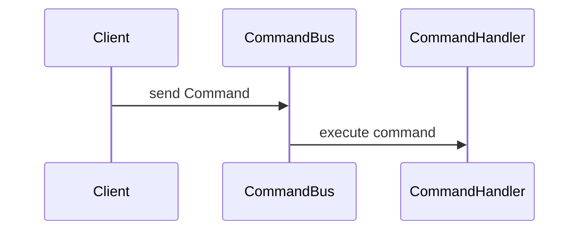

## Commanding component

This component contains these main concepts:

* [`Command`](./Domain/Command.php)
* [`CommandBus`](./Infrastructure/CommandBus.php)
* [`CommandHandler`](./Infrastructure/CommandHandler.php)

These components interact in the following way:

### The `Command`

A `Command` is an immutable payload composed of:

* a **name** describing the intent of the operation that we want to perform
    * this should be to the imperative tense, since we are telling our system what to do
        * for example:
            * `PayInvoice`
            * `DeactivateCustomer`
* fields containing **context** required to perform the operation
    * for example:
        * the ID of the invoice that we want to pay
        * who is performing the action

A `Command` only contains the information necessary to perform an operation, and
it should only be executed once, since each execution mutates state, unless you
explicitly design for idempotency.

### The `CommandBus`

A `CommandBus`, in general, is a `function execute(object $command): void`.
The `CommandBus` implementation is responsible for finding **one and exactly one**
command handler, and executing it.

The purpose of the `CommandBus` interface is to abstract the idea that some work "will be
performed", so that **consumers**  of the `CommandBus` interface **do not need to know** where,
nor when, nor how a `Command` will be processed.

While the concept itself looks extremely brittle on the surface it allows for declaring
that:

* some state-modifying operation will happen
* the operation may fail
* the operation may be performed synchronously or asynchronously, but the consumer
  shouldn't care about it.

Because the `CommandBus` interface is very limited in scope, it allows for introducing
multiple decorators for performing various operations that would be tedious to repeat
otherwise:

* logging performed operations
* logging failures
* re-trying operations a number of times, before giving up
* timing/profiling slow operations
* rate-limiting incoming commands
* authenticating/authorizing commands
* etc.

### The `CommandHandler`

A `CommandHandler` is a function that:

* exposes the `Command` type that it supports
* delegates execution of actual work to the business domain, by talking to other infrastructural
  components (repositories, external services) in the process.
