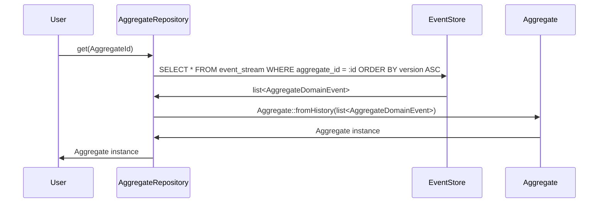
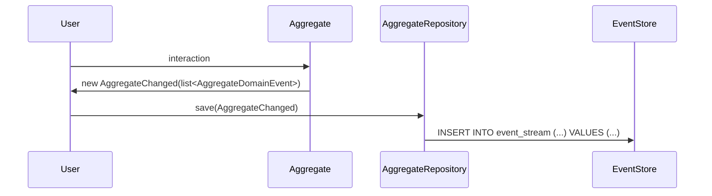

# Aggregates

Since the state of an event-sourced system depends on its history, we can isolate small self-contained
state machines called a `Aggregate`s (sometimes "Aggregate Root", although this project does not
attempt to go into those semantics).

An [`Aggregate`](Aggregate.php) is a state machines with a well defined lifecycle.
In an event-sourced system, this lifecycle is determined by an ordered list
of [domain events](../README.md) that tell its entire story.

An `Aggregate` is an aggregation of state: in our case, that means that it is a list of events, grouped
by a common identifier (an [`AggregateId`](AggregateId.php)), and in a specific ordered
sequence (the version of our `Aggregate`).

The job of an aggregate is to decide what state transitions are allowed within a state machines.

## Examples of possible `Aggregate` state machines

* in a `BowlingMatch`:

  ```mermaid
  stateDiagram-v2
      state BowlingMatch {
          [*] --> MatchInProgress: BallThrown
          MatchInProgress --> MatchInProgress: BallThrown
          MatchInProgress --> MatchEnded: BallThrown
      }
  ```

* in a `ShoppingCart`:

  ```mermaid
  stateDiagram-v2
      state ShoppingCart {
          [*] --> CartNotEmpty: CartItemAdded
          CartNotEmpty --> CartNotEmpty: CartItemAdded
          CartNotEmpty --> CartNotEmpty: CartItemRemoved
          CartNotEmpty --> CartEmpty: CartItemRemoved
          CartEmpty --> CartNotEmpty: CartItemAdded
          CartNotEmpty --> Purchased: CartCheckedOut
      }
  ```

* in a `Door` (although it doesn't really end!):

  ```mermaid
  stateDiagram-v2
      state Door {
          Closed --> Open: DoorOpened
          Open --> Closed: DoorClosed
          Locked --> Unlocked: DoorUnlocked
          Unlocked --> Locked: DoorLocked
          Unlocked --> Open: DoorOpened
          Closed --> Locked: DoorLocked
      }
  ```

In each of the above examples, each state transition could be represented by a `DomainEvent`.

## Saving **state machine** domain events

A [`DomainEvent`](../DomainEvent.php) associated with an [`Aggregate`](Aggregate.php)
usually carries some additional information:

 * the [`AggregateId`](AggregateId.php)
 * the type of the `Aggregate` it is associated with

This is abstracted here in a more specific [`AggregateDomainEvent`](AggregateDomainEvent.php) definition.

Whenever interacting with an `Aggregate`, the result of the interaction should be
an [`AggregateChanged`](AggregateChanged.php) containing all of the [`AggregateDomainEvent`s](AggregateDomainEvent.php)
raised.

Note how the [`AggregateChanged`](AggregateChanged.php) requires a version to be given: this
is a way to implement optimistic locking, and guaranteeing that aggregate domain events are
correctly ordered in the event store.

## Generating events from an `Aggregate`

In order to generate events in an `Aggregate`, you must:

1. compute the current `Aggregate` state through its **history** (`Aggregate::fromHistory()`)
2. apply the wished operation
3. extract the events produced during the state mutation

When creating an aggregate, this means following:

```php
/** @var $allDoors \EventSourcingWorkshop\EventSourcing\Domain\Aggregate\AggregateRepository<Door> */
$door = new Door('Entrance Door');

$allDoors->save($door->close());
```

When loading an aggregate, instead:

```php
/** @var $allDoors \EventSourcingWorkshop\EventSourcing\Domain\Aggregate\AggregateRepository<Door> */
$door = $allDoors->get(DoorId::fromName('Entrance Door'));

$allDoors->save($door->lock());
```

---

#### Loading/Saving an `Aggregate`

When you load an `Aggregate` through an [`AggregateRepository`](AggregateRepository.php), what happens under
the hood is following:



What is perhaps counter-intuitive is that we don't save an `Aggregate`, but rather what
happened to it:


