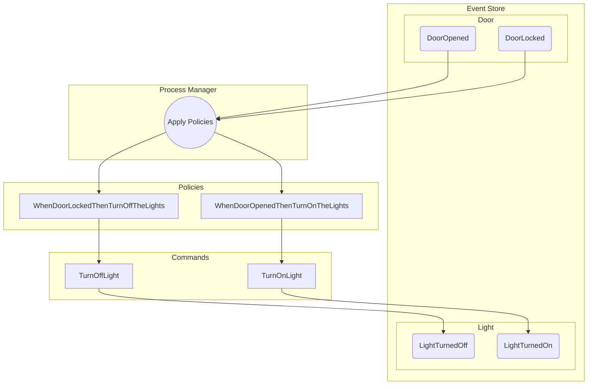
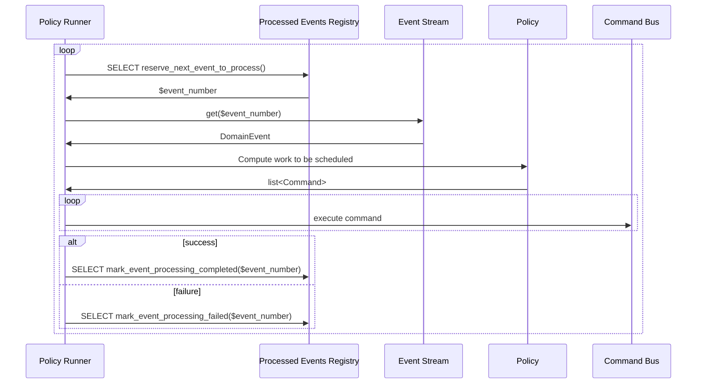

# Policies

A [`Policy`](Policy.php) is a "when this happened, make this happen" rule.

In this project, a policy is a simplified function that produces a
list of [`Command`s](../../Commanding/Domain/Command.php) to be executed
whenever a certain [`DomainEvent`](README.md) is observed.

#### Reacting to domain events

Since every change in an event-sourced system is an event, it is possible to put policies
([`Policy`](Policy.php)) in place, so that when an event is observed, further
business processes can be automated.

This allows for very complex business processes to be decomposed into many small bite-sized
state mutations, each providing continuation into the next process (which may reside in a
different subdomain).

**Important**: policies perform "follow-up work", and therefore, contrary to projections, they
**cannot** be re-run.

For example, you don't want to re-send registration mails for users that registered
years ago, so you will need to keep track of which work you've already done!

In the following example, we turn the lights on or off based on whether a door was opened or closed:

## Implementation

The policy runner works as following under the hood:

