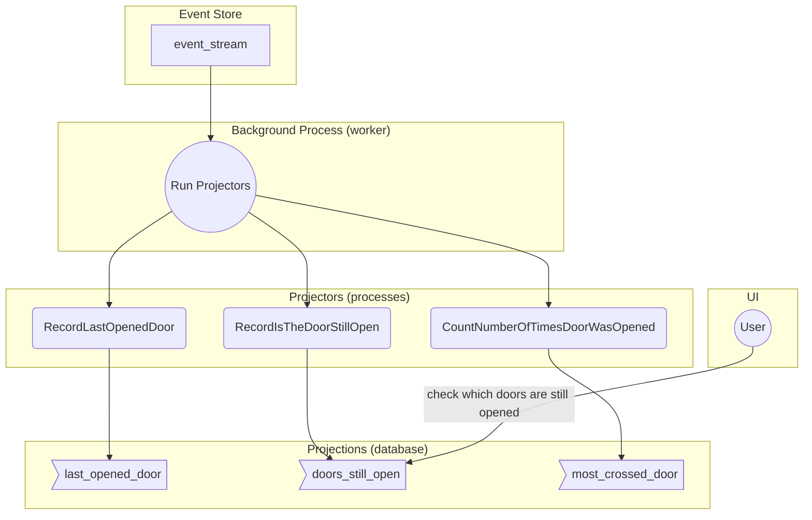
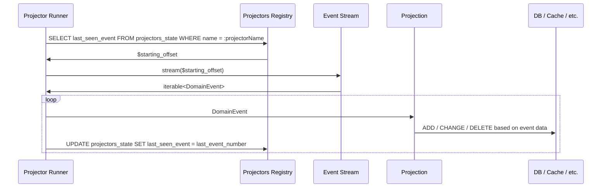

# Projectors

A projector is a stateful operation similar to `array_reduce($items, $function, $initialState)` where:

* `$items` is a `list<DomainEvent>`
* `$function` is some sort of transformation generating state
* `$initialState` is either an empty state, or the state at which we ran the projector the last time.

Because event-sourced systems are based on the assumption that the [event store](../../Domain/README.md)
is an append-only data structure, we can:

* operate on it as if it was a big iterator of events - usually referred to as an "event stream"
* ignore any state we've already seen, therefore making `$initialState` a safe assumption
* re-run the whole projection from scratch whenever needed

## Producing meaningful data/reports

When we need to compute information for reports/views, direct access to the event store is to be avoided,
since the data is presented there in a non-relational form, and hard to read in an efficient way.

Instead, a process called "projection" will (synchronously or asynchronously) copy the information from
the event store into a more manageable "
read-model" ([`DbTableProjectionDefinition`](DbTableProjectionDefinition.php)).

Such projections can generate any sort of data structure, while scanning the event store linearly, and
can be re-generated from scratch, at the cost of processing time.

Since all past state is known, and never changes, we can:

* generate state for the past (historical state)
* stop and resume projections, and continue from where we left off
    * this gives us good resiliency to crashes too!

In the following example, we stream history through a series of projectors, and produce
more user-friendly views of the current state of the system that we want to observe.

## Implementation

This is how a projector operates under the hood:

