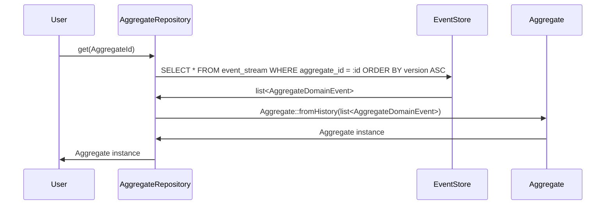
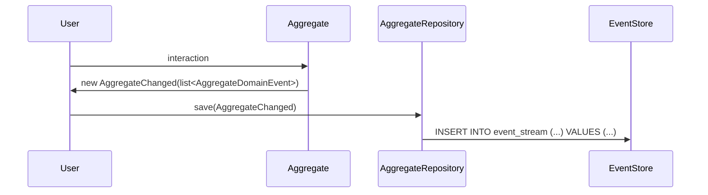
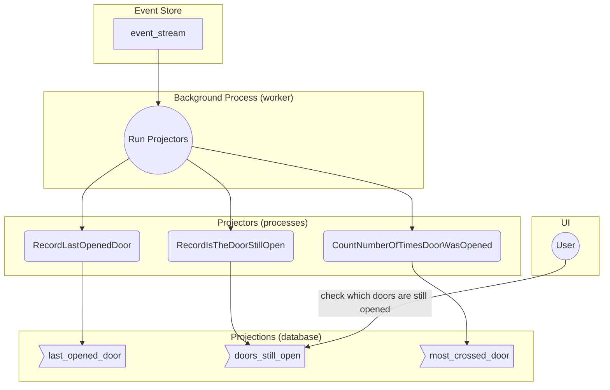
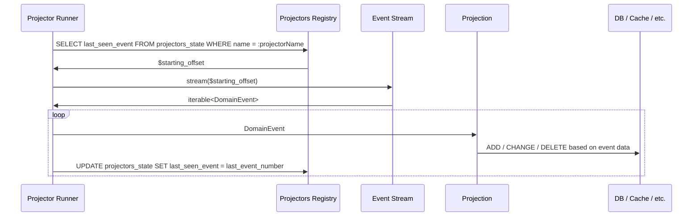
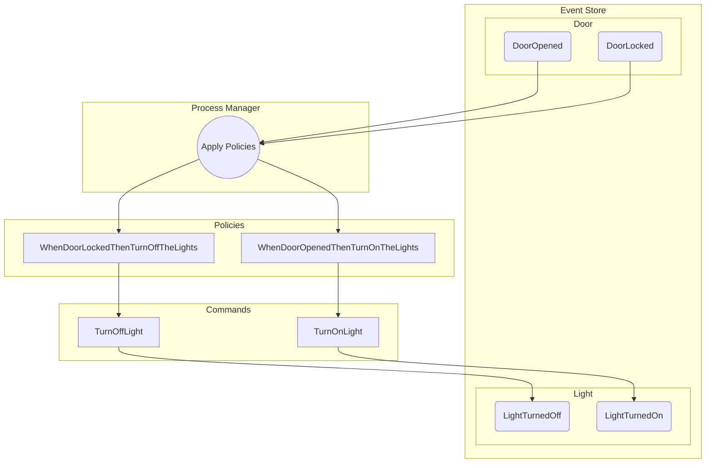
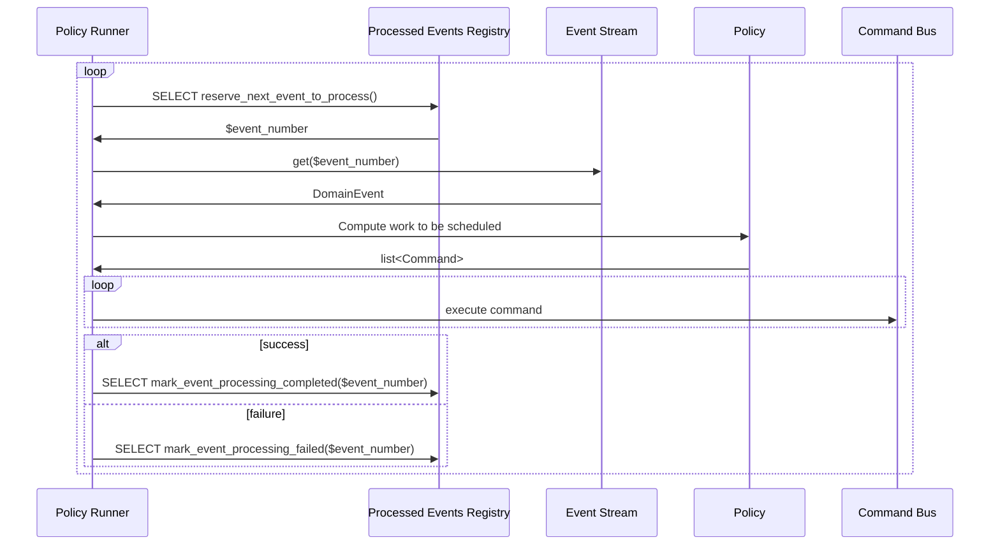

# Event Sourcing component

## What is Event Sourcing?

Event sourcing is a practice that allows representing application state through a series of "events"
that represent the full history of said state.

The idea comes from other fields of engineering, accounting, banking, legal and similar more mature fields.

For example, in the context of banking, the balance of your bank account is computed off the list of all past
transactions, and never stored as-is, as that would remove any papertrail on how the money was moved.

---

## Event Sourcing Concepts

### Domain Events

State mutations in an event-source system are described through **domain events**.

A domain event is an **immutable** payload with following properties:

1. it is **pertinent** to the current business domain
2. it has a **name**, describing what it is about
    * this should be to the past tense, and the reader should understand what is going on from its name
    * i.e. `CustomerCompletedPayment` or `SubscriptionRenewed`
3. it contains **point in time** at which it occurred
4. it contains further **contextual information** necessary to understand the event in isolation

A good domain event attempts to answer to the ["Five W" questions](https://en.wikipedia.org/wiki/Five_Ws):

* **Who** - context
* **What** - name of the event
* **When** - time at which the event was raised
* **Where** - context
* **Why** - context (although not always necessary: sometimes we don't know why something happened)

In the scope of this application, a [`DomainEvent`](./Domain/DomainEvent.php) interface was defined.

---

### Producing events

Events are generally (but not exclusively) raised in two ways:

1. direct recording of an occurred fact (standalone domain event)
    * for example:
        * `TemperatureRecorded`
        * `EmailReceived`
        * `ADayHasPassed`
2. as part of a state mutation in a process under our own control (an [`Aggregate`](./Domain/Aggregate/Aggregate.php))
    * for example
        * in a `ShoppingCart` aggregate:
            * `ItemAddedToShoppingCart`
            * `ItemRemovedFromShoppingCart`
            * `ShoppingCartPurchased`
        * in a `Shipment` aggregate:
            * `ShipmentAssembled`
            * `ShipmentShipped`
            * `ShipmentDelivered`
            * `ShipmentLost`

An event must first be persisted to the event store, before being passed on to further systems.

### Saving **standalone** domain events

Storing a standalone domain event akin an `INSERT` operation:

```sql
INSERT INTO event_stream (event_type, time_of_recording, payload)
VALUES (:nameOfTheEvent, :timeOfEventCreation, :eventContext);
```

In this project, you can use the [`EventStore`](./Infrastructure/Persistence/EventStore.php) abstraction
to save events:

```php
/** @var $clock \StellaMaris\Clock\ClockInterface */
/** @var $eventStore \EventSourcingWorkshop\EventSourcing\Infrastructure\Persistence\EventStore */
$eventStore->save(
    new TemperatureRecorded('roof', $sensors->roof->temperature(), $clock->now()),
    new TemperatureRecorded('floor', $sensors->floor->temperature(), $clock->now()),
    new TemperatureRecorded('basement', $sensors->basement->temperature(), $clock->now()),
);
```

**Note:** the event store only supports `INSERT` operations: `UPDATE` and `DELETE` are not supported. This
is by design, since history doesn't change, after it was recorded.

**Note:** in this workshop, we store the events in a relational database, but you can pick any storage
technology that guarantees durable, atomic persistence of events.

**Note:**: This is like blockchain, minus the bullshit.

---

### Saving **process** domain events

Since the state of an event-sourced system depends on its history, we can isolate small self-contained
processes called an `Aggregate`s (sometimes "Aggregate Root", although this project does not
attempt to go into those semantics).

An `Aggregate` is an aggregation of state: in our case, that means that it is a list of events, grouped
by a common identifier (an [`AggregateId`](./Domain/Aggregate/AggregateId.php)), and in a specific ordered
sequence (the version of our `Aggregate`).

The job of an aggregate is to decide what state transitions are allowed within a process.

For example:

* in a `BowlingMatch`:

  ```mermaid
  stateDiagram-v2
      state BowlingMatch {
          [*] --> MatchInProgress: BallThrown
          MatchInProgress --> MatchInProgress: BallThrown
          MatchInProgress --> MatchEnded: BallThrown
      }
  ```

* in a `ShoppingCart`:

  ```mermaid
  stateDiagram-v2
      state ShoppingCart {
          [*] --> CartNotEmpty: CartItemAdded
          CartNotEmpty --> CartNotEmpty: CartItemAdded
          CartNotEmpty --> CartNotEmpty: CartItemRemoved
          CartNotEmpty --> CartEmpty: CartItemRemoved
          CartEmpty --> CartNotEmpty: CartItemAdded
          CartNotEmpty --> Purchased: CartCheckedOut
      }
  ```

* in a `Door` (although not really a process!):

  ```mermaid
  stateDiagram-v2
      state Door {
          Closed --> Open: DoorOpened
          Open --> Closed: DoorClosed
          Locked --> Unlocked: DoorUnlocked
          Unlocked --> Locked: DoorLocked
          Unlocked --> Open: DoorOpened
          Closed --> Locked: DoorLocked
      }
  ```

---

##### Generating events from an `Aggregate`

In order to generate events in an `Aggregate` you must:

1. compute the current `Aggregate` state through its **history** (`Aggregate::fromHistory()`)
2. apply the wished operation
3. extract the events produced during your the state mutation

When creating an aggregate, this means following:

```php
/** @var $allDoors \EventSourcingWorkshop\EventSourcing\Domain\Aggregate\AggregateRepository<Door> */
$door = new Door('Entrance Door');

$allDoors->save($door->close());
```

When loading an aggregate, instead:

```php
/** @var $allDoors \EventSourcingWorkshop\EventSourcing\Domain\Aggregate\AggregateRepository<Door> */
$door = $allDoors->get(DoorId::fromName('Entrance Door'));

$allDoors->save($door->lock());
```

---

#### Loading/saving an `Aggregate`

When you load an `Aggregate` through an `AggregateRepository`, what happens under the hood is following:



What is perhaps counter-intuitive is that we don't save an `Aggregate`, but rather what
happened to it:



---

#### Producing meaningful data/reports

When we need to compute information for reports/views, direct access to the event store is to be avoided,
since the data is presented there in a non-relational form, and hard to read in an efficient way.

Instead, a process called "projection" will (synchronously or asynchronously) copy the information from
the event store into a more manageable "
read-model" ([`DbTableProjectionDefinition`](./Infrastructure/Projection/DbTableProjectionDefinition.php)).

Such projections can generate any sort of data structure, while scanning the event store linearly, and
can be re-generated from scratch, at the cost of processing time.

Since all past state is known, and never changes, we can:

* generate state for the past (historical state)
* stop and resume projections, and continue from where we left off
    * this gives us good resiliency to crashes

In the following example, we stream history through a series of projectors, and produce
more user-friendly views of the current state of the system that we want to observe.



This is how a projector operates under the hood:



---

#### Reacting to domain events

Since every change in an event-sourced system is an event, it is possible to put policies
([`Policy`](./Domain/Policy.php)) in place, so that when an event is observed, further
business processes can be automated.

This allows for very complex business processes to be decomposed into many small bite-sized
state mutations, each providing continuation into the next process (which may reside in a
different subdomain).

**Important**: policies perform "follow-up work", and therefore, contrary to projections, they
**cannot** be re-run. You don't want to re-send registration mails for users that registered
years ago, so you will need to keep track of which work you've already done.

In the following example, we turn the lights on or off based on whether a door was opened or closed:



The policy runner works as following under the hood:

