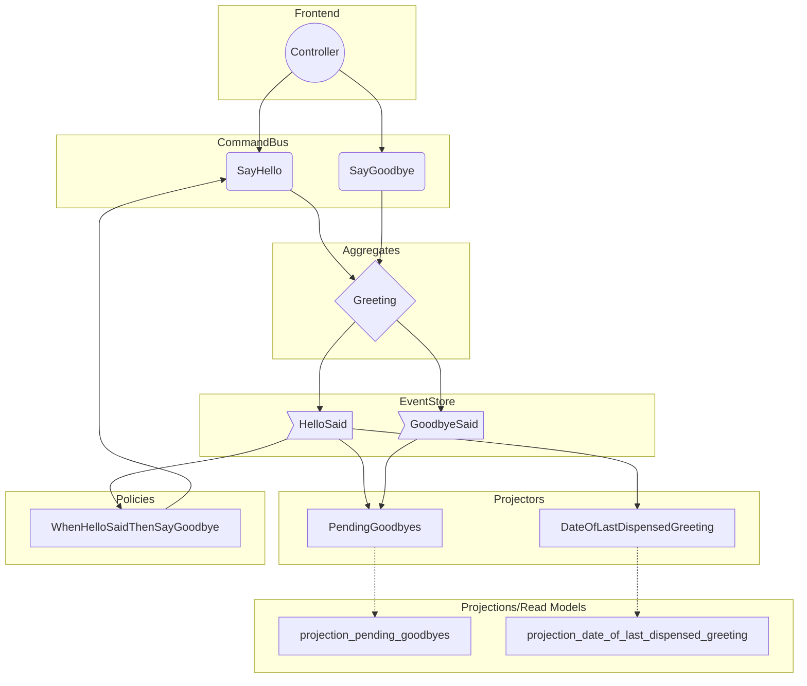

## EventSourcing example domain

This directory contains test assets that form a small event-sourcing functioning code example.

It is designed to demonstrate how to implement common business logic scenarios through the
facilities of the [`EventSourcingWorkshop\EventSourcing`](../../../src/EventSourcing) component.

You can take the code from this directory, and use it as a blueprint for future business
scenarios, after having properly event-stormed them.

## Rough structure

 * [`Greeting`](./Domain/Greeting.php), which is an event-sourced aggregate:
    * created by firing [`SayHello`](./Domain/Command/SayHello.php)
    * terminated by a [`SayGoodbye`](./Domain/Command/SayGoodbye.php)
 * domain events raised by interacting with [`Greeting`](./Domain/Greeting.php):
    * [`HelloSaid`](./Domain/DomainEvent/HelloSaid.php) 
    * [`GoodbyeSaid`](./Domain/DomainEvent/GoodbyeSaid.php) 
 * a [`WhenHelloSaidThenSayGoodbye`](./Domain/Policy/WhenHelloSaidThenSayGoodbye.php) policy
    * processed via `bin/console messenger:consume event_sourcing_process_manager`
 * a `projection_date_of_last_dispensed_greeting` table:
    * declared by a [db migration](./Infrastructure/Projection/DateOfLastDispensedGreeting.php)
    * populated by [`DateOfLastDispensedGreeting`](./Infrastructure/Projection/DateOfLastDispensedGreeting.php) projector
    * processed via `bin/console messenger:consume projection_date_of_last_dispensed_greeting`
 * a `projection_pending_goodbyes` table:
     * declared by a [db migration](./Infrastructure/Projection/PendingGoodbyes.php)
     * populated by [`PendingGoodbyes`](./Infrastructure/Projection/PendingGoodbyes.php) projector
     * processed via `bin/console messenger:consume projection_pending_goodbyes`

## Interaction diagram

